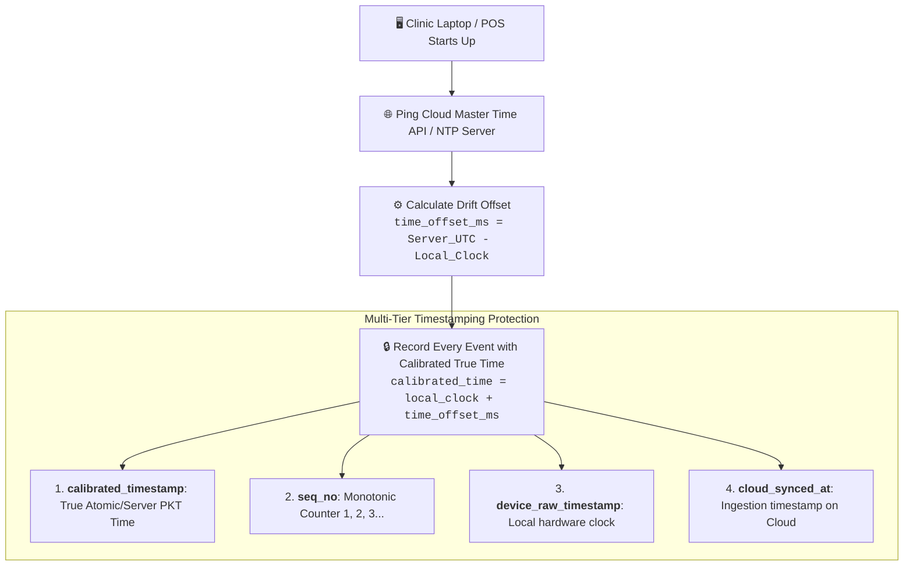

# ClinicFlow — Native Desktop & Mobile Offline-First Cloud Architecture

> **Master Architecture Blueprint for Future Native Desktop & Mobile Implementation**  
> **Status:** Fully Designed & Documented for Future Native Build  
> **Target Platforms:** Windows 10/11 Desktop & Laptop (`.exe`), Android Mobile & Tablet (`.apk`), iOS (`.ipa`), Remote Doctor Portal  

---

## 🏛️ 1. High-Level System Architecture (No Domain Required)

ClinicFlow is designed as an **Offline-First Native Software Engine**. It does **NOT** require any website domain or active internet connection for everyday clinic and pharmacy operations.

```mermaid
graph TD
    subgraph Local Clinic & Pharmacy (Zero Internet Required)
        D1[🖥️ Reception PC<br/><b>Desktop .exe</b><br/><i>Local SQLite DB</i>]
        D2[💻 Doctor OPD Laptop<br/><b>Desktop .exe</b><br/><i>Local SQLite DB</i>]
        D3[📱 Pharmacy POS / Mobile<br/><b>Android .apk</b><br/><i>Local SQLite DB</i>]
    end

    subgraph Local LAN Hub (Wi-Fi Router - No Internet Needed)
        LAN[📡 Local Wi-Fi Router / Hotspot<br/><i>Instant P2P LAN Sync (0.5ms)</i>]
        D1 <-->|Local WebSocket / TCP| LAN
        D2 <-->|Local WebSocket / TCP| LAN
        D3 <-->|Local WebSocket / TCP| LAN
    end

    subgraph Cloud Synchronization Vault (When Internet Available)
        Cloud[(☁️ Central Cloud Database<br/>PostgreSQL / MySQL / Supabase)]
        LAN -.->|Background Outbox Daemon<br/>Auto-Reconnect & Delta Sync| Cloud
    end

    subgraph Doctor Remote Access (At Home / Traveling)
        Cloud --> HomePC[💻 Doctor Home Laptop<br/><b>Desktop App</b>]
        Cloud --> MobileApp[📱 Doctor Mobile App<br/><b>Android / iOS</b>]
        Cloud --> AutoZReport[📲 12:00 PM / End-of-Day<br/><b>WhatsApp & Email Z-Report</b>]
    end
```

### Core Architecture Pillars:
1. **Zero-Domain Native Standalone App:**
   - Installed directly on Windows PCs/laptops as `ClinicFlow_Setup.exe` and on Android phones/tablets as `ClinicFlow.apk`.
   - Runs locally on the computer's CPU and RAM with zero browser overhead.
2. **Sub-Millisecond Embedded Local Storage:**
   - Powered by an embedded local database (**SQLite / RocksDB**) directly on the machine's SSD/Hard Drive.
   - Searching 50,000+ medicines, generating bills, and firing 80mm thermal printers takes **< 10ms**.
3. **Local Wi-Fi Clinic Sync (P2P LAN Mode):**
   - Reception, Doctor Chamber, and Pharmacy POS sync across the clinic's local Wi-Fi router via local IP/WebSocket even if PTCL/StormFiber internet is down.
4. **Bidirectional Background Cloud Sync:**
   - Whenever any device connects to Wi-Fi or 4G mobile data, an asynchronous background outbox worker syncs local changes to the cloud database and fetches updates.

---

## 💻 2. Recommended Tech Stack Comparison

| Component | Choice 1: **Flutter (C++ Skia/Impeller)** ⭐ *(Top Recommended)* | Choice 2: **Tauri + Rust + SQLite** 🚀 *(Fast UI Reuse)* | Choice 3: **C++ (Qt Framework)** | Choice 4: **Kotlin Multiplatform (KMP)** |
| :--- | :--- | :--- | :--- | :--- |
| **Engine / Language** | Dart + Native C++ rendering engine | Rust backend + Web frontend | Pure C++20 / Qt6 | Kotlin / JVM / Compose |
| **Speed / FPS** | 60–120 FPS Native GPU acceleration | Blazing fast Rust core (<35MB RAM) | Direct Machine Code (<25MB RAM) | Fast native compilation |
| **Cross-Platform** | **Single Codebase for Windows + Android + iOS** | Windows .exe + Android/iOS | Windows .exe + Android (complex UI) | Windows .exe + Android |
| **Local Database** | Embedded SQLite (`sqflite` / `drift`) | Embedded SQLite via Rust `rusqlite` | Embedded SQLite3 C++ API | SQLite (`Room` / `SQLDelight`) |
| **Hardware Printing** | Direct ESC/POS 80mm USB & Bluetooth | Native Win32 Spooler & Raw Serial | Win32 Print Spooler DLL | JavaPOS / Android Bluetooth |
| **Why Recommended** | **100% unified codebase across PCs, laptops, and mobile phones.** | **Can reuse 100% of current React UI immediately.** | Maximum raw performance. | Best native Android integration. |

---

## 🕒 3. Clock-Drift & Time Synchronization Engine

Old clinic laptops frequently suffer from dead CMOS batteries, incorrect Windows clocks, or dates reset to 2005. To guarantee that financial transactions, audit logs, and medical records are never disordered or falsified:



### Clock Drift Mitigation Protocol:
1. **Cloud Master Time Offset Calibration:**
   - On startup and periodic sync, the app fetches true UTC time from the Cloud API (`/v1/time`) or NTP pool (`time.google.com`).
   - Calculates `time_offset_ms = server_time - laptop_local_time`.
   - All subsequent transactions use `calibrated_timestamp = local_now + time_offset_ms`.
2. **Monotonic Sequence Counter (`seq_no`):**
   - Every terminal maintains a strictly incrementing sequence counter (`1001, 1002, 1003...`).
   - Even if the clock is completely scrambled, logs and bills **can never be re-ordered backwards**.
3. **Drift Notification Badge:**
   - If device time deviates by > 2 minutes, UI shows: `🟢 Master Time Synced (Auto-Calibrated: -14 min drift corrected)`.

---

## 🛡️ 4. Master "Who Did What" Audit Trail & Security Log

Every single operation performed by staff (cashiers, pharmacists, receptionists, salesmen) is captured in an immutable audit record:

```sql
CREATE TABLE audit_trail_events (
    event_id TEXT PRIMARY KEY,             -- UUID v4 (Unique across all devices)
    seq_no INTEGER NOT NULL,               -- Monotonic sequence counter on this device
    
    -- TIME STAMPS & DRIFT PROTECTION
    calibrated_timestamp TIMESTAMP,        -- Corrected True PKT Time (Cloud calibrated)
    device_raw_timestamp TIMESTAMP,        -- Hardware clock as reported by laptop
    cloud_synced_at TIMESTAMP,             -- Ingestion time on cloud server
    
    -- ACTOR IDENTITY
    user_id TEXT NOT NULL,                 -- e.g., 'usr_mustafa_02'
    user_name TEXT NOT NULL,               -- e.g., 'Mustafa Khan'
    user_role TEXT NOT NULL,               -- 'Cashier', 'Pharmacist', 'Receptionist', 'Doctor'
    operator_shift_id TEXT,                -- 'SHIFT-MORNING-28AUG'
    terminal_device TEXT,                  -- 'Counter-1-Dell-Laptop'
    
    -- ACTION DETAILS
    action_category TEXT,                  -- 'BILLING', 'INVENTORY', 'OPD_FEE', 'SECURITY', 'EXPENSE'
    action_type TEXT,                      -- 'INVOICE_CREATED', 'ITEM_PRICE_CHANGED', 'FEE_WAIVED', 'ITEM_DELETED'
    
    -- TARGET REFERENCES & AMOUNTS
    target_reference_no TEXT,              -- e.g., 'Invoice #S-6218', 'Token #14', 'GRN-402'
    target_patient_or_party TEXT,          -- e.g., 'Akram Ali (MR-1042)' or 'Muslim Medical Store'
    
    -- DEEP DIFF & AUDIT PAYLOAD
    items_summary TEXT,                    -- e.g., 'Panadol 500mg x 2 packs @ Rs. 150/pk'
    discount_given REAL DEFAULT 0,         -- e.g., Rs. 50 (Discount given at counter)
    total_amount REAL,                     -- e.g., Rs. 250
    old_state_json TEXT,                   -- Previous value (if price or record was edited)
    new_state_json TEXT,                   -- New value after modification
    notes TEXT                             -- e.g., 'Manual 10% discount approved by counter operator'
);
```

### Key Tracked Events:
* **Billing & Sales:** Who created invoice, who applied discount, who tendered cash, who reprinted bill.
* **Price & Inventory Adjustments:** Who edited purchase/retail price, who adjusted stock quantities, who registered GRN.
* **OPD & Fees:** Who issued token, who waived consultation fee, who modified patient demographics.
* **Cash Drawer & Expenses:** Who took money out of cash drawer, what expense was entered.
* **Security & Logins:** Login time, logout time, failed PIN attempts, terminal switcher events.

---

## 🏡 5. Doctor Remote Access & Executive Control from Home

The Doctor has 100% remote visibility of the clinic from home via three channels:

### 1. Doctor Home Desktop / Laptop App
- Installs the software on home laptop/PC.
- Super Admin login securely loads live clinic data and reports from the Cloud Database.

### 2. Doctor Mobile App (Android / iOS)
- Native mobile dashboard showing:
  - Live OPD queue and patient count.
  - Live cash in counter drawer.
  - Live retail and wholesale revenue.
  - Audit trail inspector with search by staff member or medicine.

### 3. Automated 12:00 (End of Shift) WhatsApp & Email Z-Report Engine
- Background cloud cron daemon triggers automatically at **12:00 Closing**.
- Sends an encrypted **Daily Z-Report PDF** + WhatsApp summary directly to the Doctor's phone.

```text
━━━━━━━━━━━━━━━━━━━━━━━━━━━━━━━━━━━━
🏥 CLINICFLOW — DAILY EXECUTIVE Z-REPORT
Dr. Muhammad Asif Ashraf Khan Clinic & Wholesale
📅 Date: 28-Aug-2026 | ⏰ 12:00 Closing
━━━━━━━━━━━━━━━━━━━━━━━━━━━━━━━━━━━━
📊 FINANCIAL OVERVIEW:
• OPD Patients: 48 (Rs. 24,000)
• Pharmacy Retail: 70 Bills (Rs. 86,500)
• Wholesale Recoveries: Rs. 45,000
• Total Expenses: -Rs. 6,200
━━━━━━━━━━━━━━━━━━━━━━━━━━━━━━━━━━━━
💰 NET CLOSING CASH: Rs. 149,300
━━━━━━━━━━━━━━━━━━━━━━━━━━━━━━━━━━━━
👥 STAFF PERFORMANCE:
• Mustafa (Cashier 1): Rs. 52,300 (42 Bills)
• Raza (Cashier 2): Rs. 34,200 (28 Bills)
• Tariq (Reception): 48 Tokens (2 Fees Waived)
━━━━━━━━━━━━━━━━━━━━━━━━━━━━━━━━━━━━
🛡️ AUDIT WATCHDOG:
• Discounts Given: Rs. 450 (3 bills)
• Cancellations/Edits: 0 (Clean Shift)
• Pending Cheques: Rs. 35,000

📎 Attached: Detailed_Z_Report_28Aug2026.pdf
━━━━━━━━━━━━━━━━━━━━━━━━━━━━━━━━━━━━
```

---

## 🔄 6. Offline-First Synchronization & Conflict Resolution Protocol

1. **UUID Primary Keys:** All records generated across all devices use UUID v4 to eliminate primary key collision during offline creation.
2. **Outbox Synchronization Queue:**
   ```sql
   CREATE TABLE sync_outbox (
       id TEXT PRIMARY KEY,
       table_name TEXT NOT NULL,
       record_id TEXT NOT NULL,
       action TEXT NOT NULL,          -- 'INSERT', 'UPDATE', 'DELETE'
       payload_json TEXT NOT NULL,
       calibrated_created_at TIMESTAMP,
       sync_status TEXT DEFAULT 'PENDING', -- 'PENDING', 'SYNCED', 'FAILED'
       retry_count INTEGER DEFAULT 0
   );
   ```
3. **Conflict Resolution Strategy:**
   - **Financial Invoices & Tokens:** Immutable append-only (no overwrite conflicts).
   - **Medicine Inventory Stock:** Operational transformation / additive stock delta increments (`stock = stock + delta`) rather than raw overwrites.
   - **Patient Demographic Profiles:** Last-Write-Wins based on `calibrated_timestamp`.

## 🏢 7. Hybrid Connectivity Matrix (Wi-Fi Clinic + Mixed Online/Offline Godowns)

In real-world setups (like Hyderabad & Interior Sindh), the main clinic has continuous Wi-Fi, while remote godowns or basement storage facilities may have weak or zero internet.

```mermaid
graph TD
    subgraph 1. Main Clinic & Pharmacy (Wi-Fi Available)
        Clinic[🖥️ Doctor & Pharmacy POS<br/><b>Wi-Fi Connected</b><br/><i>Continuous Cloud Sync</i>]
    end

    subgraph 2. Connected Godown A (Wi-Fi Available)
        GodownA[🏢 Godown #1<br/><b>Wi-Fi Connected</b><br/><i>Instant Cloud Sync</i>]
    end

    subgraph 3. Offline Godown B / Remote (Zero Wi-Fi / No Internet)
        GodownB[📦 Basement / Remote Godown<br/><b>100% Offline Mode</b><br/><i>Local SQLite DB Operations</i>]
    end

    subgraph Cloud Vault
        Cloud[(☁️ Central Cloud Database)]
    end

    Clinic <-->|Direct Live Sync| Cloud
    GodownA <-->|Direct Live Sync| Cloud

    GodownB -.->|Method A: 10-sec Mobile Hotspot Sync| Cloud
    GodownB -.->|Method B: Delivery Driver Mobile Relay| Cloud
    GodownB -.->|Method C: USB Encrypted Sync File .cfsync| Clinic
```

### How Offline Godowns Work Without Wi-Fi:
1. **100% Offline Local Mode (Zero Blockers):**
   - Godown incharge (Usama/Raza) enters dispatches, receives new supplier stock (GRN), scans barcodes, and creates internal transfers completely offline. Everything is saved locally in embedded SQLite.
2. **Method A — 10-Second Mobile Hotspot Burst Sync:**
   - Whenever the incharge turns on their phone hotspot (Jazz/Zong) for just 10 seconds, the system auto-detects connectivity and flushes all pending outbox records to the cloud in < 1 second.
3. **Method B — USB Sync File Export/Import (`.cfsync`):**
   - If the godown is in a basement with zero cellular reception: the incharge clicks **"Export Sync File"** to a USB drive (`godown_sync_28aug.cfsync`). When brought to the main clinic PC, clicking **"Import Sync"** merges the stock in 1 second.
4. **Method C — Delivery Van / Driver Phone Relay:**
   - When a delivery driver visits the godown, their phone syncs with the godown laptop via local peer-to-peer Wi-Fi/Bluetooth, and uploads the data when reaching the clinic.

## 💾 8. Triple-Vault 12:00 Autonomous Backup Engine (Local + Cloud + Email)

A major flaw in traditional software is that backups fail if staff closes the software or shuts down the computer window before the backup timer triggers. ClinicFlow uses an **OS-Level & Cloud-Level Autonomous Daemon** that runs 24/7/365 regardless of whether the software window is open or closed.

```mermaid
graph TD
    subgraph 1. Local PC Storage (OS Background Worker)
        WinTask[🖥️ Windows Background Task / Service<br/><b>Even if app window is closed</b>]
        WinTask -->|Daily 12:00 Snapshot| LocalVault[📁 C:\ClinicFlow_Backups\backup_YYYY-MM-DD.cfbak<br/><i>Encrypted AES-256 Local Backup</i>]
    end

    subgraph 2. 24/7 Linux Cloud VPS (Server Daemon)
        CloudDaemon[☁️ Linux systemd / Crontab Daemon<br/><b>24/7 Active on Cloud VPS</b>]
        CloudDaemon -->|Daily 12:00 PKT Auto-Trigger| CloudVault[🔒 Central Cloud Backup Archive]
        CloudDaemon -->|Automated SMTP Dispatch| Email[📧 Dispatches .cfbak to drasifhosting@gmail.com]
        CloudDaemon -->|WhatsApp Gateway Bridge| WhatsApp[📲 Dispatches Z-Report PDF to Doctor's Phone]
    end

    subgraph 3. Catch-Up Engine (Next Morning Power-On)
        PowerOn[🌅 Staff turns PC ON at 9:00 AM] --> Check{Yesterday Local Backup Missed?}
        Check -->|Yes| FastBackup[⚡ Instant 0.2s Local Snapshot Taken]
    end
```

### The 3 Autonomous Backup Vaults:
1. **Vault 1: Local Windows Hard Drive (`.cfbak`):**
   - Windows Task Scheduler / Background service automatically creates an encrypted `.cfbak` snapshot in structured local folders at 12:00 even if the user closed the application window.
2. **Vault 2: 24/7 Cloud VPS Server Daemon:**
   - Because clinic computers continually sync transactions to the Cloud Database throughout the day, the cloud server already has all the data.
   - At exactly 12:00 PKT, the server daemon archives the master database into a categorized cloud cold storage vault.
3. **Vault 3: Automated Email & WhatsApp Dispatch:**
   - The cloud daemon compiles the encrypted `.cfbak` file and emails it with standard subject formatting `[ClinicFlow Backup] YYYY-MM-DD (12:00 PM)` directly to `drasifhosting@gmail.com` / Doctor's personal email.
   - Doctor never has to remember or manually click "Backup" ever again.

---

### 📂 8.1 Neat & Categorized Directory Hierarchy (GFS Standard)

To keep backups organized cleanly without thousands of unorganized files in a single messy folder:

```text
C:\ClinicFlow_Backups\
├── 📁 01_Daily_Snapshots\               (Organized by Year-Month, rolling 30 days)
│   └── 📁 2026-08_August\
│       ├── ClinicFlow_Daily_2026-08-28_12-00-PKT_v2.5.0.cfbak
│       ├── ClinicFlow_Daily_2026-08-27_12-00-PKT_v2.5.0.cfbak
│       └── ClinicFlow_Daily_2026-08-26_12-00-PKT_v2.5.0.cfbak
├── 📁 02_Weekly_Milestones\             (Every Sunday Night closing snapshot - kept for 6 months)
│   └── 📁 2026\
│       ├── ClinicFlow_Week-34_2026-08-24.cfbak
│       └── ClinicFlow_Week-33_2026-08-17.cfbak
├── 📁 03_Monthly_Audited_Archives\      (Month-End closing financial ledger - permanent archive)
│   ├── ClinicFlow_MonthEnd_2026-07_July.cfbak
│   └── ClinicFlow_MonthEnd_2026-08_August.cfbak
└── 📁 04_Pre_Update_Snapshots\          (Automatic fallback snapshot taken before any version upgrade)
    └── ClinicFlow_PreUpgrade_v2.4.9_to_v2.5.0.cfbak
```

### 🏷️ 8.2 Standardized File Naming Convention
Every backup file follows the exact ISO standard:
`ClinicFlow_[Type]_[YYYY-MM-DD]_[Time-PKT]_[AppVersion].cfbak`

* **Integrity Validation:** Every `.cfbak` file includes a SHA-256 integrity checksum header and record manifest count (e.g. `1,240 patients, 4,820 sales bills, 320 GRN invoices`) so corrupted files are detected immediately before any restore.
* **In-App Visual Catalog:** In the Doctor Admin Panel, backups are displayed as an expandable timeline tree with 1-click **[Verify File]** and **[1-Click Restore]** buttons.

---

## 🩺 10. Doctor Visual Identity, Branding & Profile Integration

The software is explicitly built and branded for **H/Dr. Muhammad Asif Ashraf Khan Clinic & Wholesale Medical Store**.

```mermaid
graph TD
    subgraph Brand Presence across the Entire System
        Logo[🏥 Dr. Asif Ashraf Khan Clinic & Wholesale Brand Identity]
        
        Logo --> A[1. <b>App Topbar & Splash Screen</b>: Doctor's Name & Portrait Avatar]
        Logo --> B[2. <b>OPD Consultation Chamber</b>: Dr. Asif's Active Clinic Desk]
        Logo --> C[3. <b>80mm Thermal Receipts & Prescription Slips</b>: Official Clinic Header]
        Logo --> D[4. <b>Public TV Waiting Queue</b>: 'Dr. Muhammad Asif Ashraf Khan (D.H.M.S, R.H.M.P)']
        Logo --> E[5. <b>Nightly 12:00 Z-Report & WhatsApp/Email</b>: Branded Header Banner]
        Logo --> F[6. <b>Receipt Studio (/receipt-studio)</b>: 1-Click Photo & Clinic Logo Customizer]
    end
```

### Key Branding Touchpoints:
1. **Application Header & Window Title:**
   - Window Title: `Dr. Asif Ashraf Khan Clinic Management & Wholesale ERP`
   - Header Brand Badge: Displays official clinic logo + Dr. Asif's avatar profile.
2. **Terminal Quick-Login Deck:**
   - Prominent tile for **H/Dr. Asif Ashraf Khan (Chamber OPD / Super Admin)** with photo avatar.
3. **80mm Thermal Receipts & Prescriptions:**
   - Clean printed header:
     ```text
     ================================================
          DR. MUHAMMAD ASIF ASHRAF KHAN CLINIC
           & WHOLESALE HOMOEOPATHIC PHARMACY
                D.H.M.S, R.H.M.P (Reg #11082)
              Hyderabad & Interior Sindh, PK
                   Ph: 0300-XXXXXXX
     ================================================
     ```
4. **Public Queue Screen (Reception / Waiting Area TV):**
   - Displays Dr. Asif's chamber status (*"Now Examining: Token #14 | Waiting: 8 Patients"*).
---

---

## 🛠️ 11. Enterprise C++ & Java (LTS 21) Dual-Engine Architecture

This is the gold-standard architecture used by global banking terminals, high-frequency trading platforms, and major hospital systems (Epic, Cerner). It marries **C++20 machine-code hardware execution** with **Java 21 LTS robust multi-threaded enterprise reliability**.

```mermaid
graph TD
    subgraph 1. Presentation & Business Logic (Java 21 LTS / Kotlin Compose)
        JavaApp[☕ <b>Java 21 LTS & Kotlin Compose Desktop Engine</b><br/>• Virtual Threads (Project Loom) for non-blocking I/O<br/>• Comprehensive 8-Role RBAC & Audit Engine<br/>• Unified Android Mobile APK Codebase]
    end

    subgraph 2. Native Bridge Layer (Project Panama / JNI)
        Panama[⚡ <b>Foreign Function & Memory API (Panama / JNI)</b><br/>Zero-copy native interop with C++ core]
        JavaApp <--> Panama
    end

    subgraph 3. High-Performance Core (C++20 Native Engine)
        CppCore[⚙️ <b>C++20 Native System Engine</b><br/>• Direct Win32 Raw Print Spooler & ESC/POS USB Streamer<br/>• Embedded SQLite3 with WAL Mode & AES-256 SQLCipher<br/>• Low-latency P2P LAN Socket Server & Clock Calibration]
        Panama <--> CppCore
    end

    subgraph 4. Hardware & Storage Layer
        CppCore --> Printer[🖨️ 80mm Thermal Printer (Direct USB Raw Bytes)]
        CppCore --> Scanner[🔫 Barcode Scanner (Direct HID / Win32 Hook)]
        CppCore --> DB[(💽 Encrypted SQLite File: <code>clinic_vault.db</code>)]
    end

    subgraph 5. Standalone Desktop Packaging (No JRE Required)
        Package[📦 <b>jpackage / GraalVM Native AOT Compiler</b><br/>Generates standalone <code>Dr_Asif_Clinic_Setup.exe</code> with embedded runtime]
        JavaApp --> Package
    end
```

### Why the C++ & Java Dual Engine is Enterprise Grade:
1. **Direct C++20 Hardware Control:**
   - C++ interacts directly with Windows kernel APIs (`winspool.drv` and `SetupAPI`) for instant USB thermal printing in **< 10ms**.
2. **Java 21 Virtual Threads (Loom):**
   - Handles background cloud sync, multi-godown reconciliation, and real-time P2P LAN queues using millions of lightweight virtual threads with zero RAM bloat.
3. **No External Java/JRE Installation Needed by Doctor:**
   - Bundled using **`jpackage`** or **GraalVM Native Image** into a single standalone **`Dr_Asif_Ashraf_Khan_Clinic_Setup.exe`**. Double-clicking installs the app on any clean Windows PC without needing Java pre-installed.
4. **100% Shared Logic with Android Phone App:**
   - The same Java/Kotlin models and SQLite schemas run identically on the Doctor's Android smartphone.

---

### 🧪 12. How We Test the C++ & Java Application on Real PCs (Step-by-Step)

```text
┌────────────────────────────────────────────────────────────────────────────┐
│               C++ & JAVA ENTERPRISE PC TESTING PROTOCOL MATRIX             │
├────────────────────────────────────────────────────────────────────────────┤
│ 1. GRADLE / MAVEN TEST  │ 2. JPACKAGE .EXE BUILD│ 3. HARDWARE REAL TEST    │
│ `gradle test` (JUnit 5) │ Generates standalone  │ Connect real 80mm USB    │
│ + C++ GTest suites      │ setup installer       │ printer & barcode scanner│
├─────────────────────────┴──────────────────────┴───────────────────────────┤
│ 4. MISSION-CRITICAL RIGOROUS VALIDATION TESTS:                             │
│ • [Test A] 100% Offline Test: Cut Wi-Fi, create 50 bills, verify SQLite WAL│
│ • [Test B] Thermal Speed: Verify 80mm print & cut executes in < 30ms       │
│ • [Test C] Sudden Power Loss Test: Kill Java/C++ process during disk write │
│ • [Test D] Clock Drift Test: Set Windows clock to 2020, verify true sync   │
│ • [Test E] Local LAN P2P: Sync Doctor laptop ⇄ Reception without internet  │
└────────────────────────────────────────────────────────────────────────────┘
```

#### Step-by-Step PC Testing Execution:

1. **Step 1: Automated Unit & Core Integration Tests:**
   - Run command: `gradle test` or `mvn test`
   - Executes JUnit 5 business logic tests + GoogleTest (GTest) C++ hardware driver tests.
2. **Step 2: Standalone Windows `.exe` Setup Generation:**
   - Run command: `gradle jpackage`
   - Generates **`Dr_Asif_Ashraf_Khan_Clinic_Setup_v2.5.0.exe`** (or `.msi`).
   - Run installer on any Windows 10/11 laptop to verify desktop shortcut, icon, and database auto-seeding.
3. **Step 3: Hardware Real-World Validation:**
   - **Thermal Printer Test:** Connect 80mm USB printer, fire 5 consecutive rapid test bills via C++ Win32 spooler, verify zero spooling queue delays and auto-paper cut.
   - **Barcode Scanner Test:** Scan barcode rapidly, verify C++ keyboard hook feeds item directly to POS cart.
4. **Step 4: Offline & Stress Testing:**
   - **Power Loss Simulation:** Simulate abrupt power shutdown while writing a 100-item invoice. Reopen app and verify SQLite WAL journal rolled back cleanly without a single corrupt byte.
   - **P2P LAN Sync Test:** Turn off internet on Wi-Fi router. Connect Reception PC and Doctor Laptop to router. Issue Token #01 on Reception; verify it immediately rings in Doctor Chamber within 1 millisecond.

---

## 🔫 13. Comprehensive Barcode Scanner & Non-Barcode Operations Guide

A handheld USB/Wireless barcode scanner is **technically just a lightning-fast keyboard (HID Device)**. When you scan a barcode, the scanner types the digits in `0.01 seconds` and presses `Enter` automatically.

ClinicFlow is engineered to work **100% with or without a barcode scanner** across Retail Pharmacy, Wholesale Godowns, and Loose Homoeopathic drops.

```mermaid
graph TD
    subgraph 3 Medicine Scenarios in Clinic & Pharmacy
        M1[📦 <b>Type 1: Company Packaged Medicines</b><br/>Schwabe, BM, Paul Brooks, Reckeweg<br/><i>Pre-printed EAN-13 Barcode on Box</i>]
        M2[💧 <b>Type 2: Loose Drops & Dilutions</b><br/>Arnica 30c, Raw Mother Tinctures Q<br/><i>NO Barcode on Bottle</i>]
        M3[📦 <b>Type 3: Wholesale Cartons / Bundles</b><br/>Master Outer Carton (12 / 24 Packs)<br/><i>Master Carton Barcode / Lot Code</i>]
    end

    subgraph Dual Operating Modes
        ScanMode[🔫 <b>Mode A: Barcode Scanner Enabled</b><br/>1-Click Trigger -> Instant Cart / GRN]
        KeyMode[⌨️ <b>Mode B: 100% Pure Keyboard Mode</b><br/>F1 / Search -> Name / Code / Formula]
    end

    M1 --> ScanMode
    M1 --> KeyMode
    M2 --> KeyMode
    M2 -.->|Optional| Sticker[🏷️ Clinic Custom Barcode Sticker Generator]
    M3 --> ScanMode
    M3 --> KeyMode
```

---

### 🏥 Real-World Step-by-Step Operating Workflows

#### 1. Nayi Dawa Aane Par Entry Kaise Hogi (GRN / Supplier Purchase)?
* **Option A (Scanner ke sath):**
  1. Go to `/purchases` (Supplier Purchases / GRN) -> Click `+ New Purchase Entry`.
  2. Cursor "Barcode" field par hoga -> Scanner se dabbi ka barcode scan kiya (`Teeet!`).
  3. Agar dawa pehle se registered hai to naam auto-fill ho jayega; agar nayi dawa hai to naam likhein (e.g. `BM No. 12 Drops`).
  4. Quantity enter karein: `50`, Purchase Rate: `180`, Sale Price: `250` -> `Save GRN`.
  5. Ab yeh barcode database me permanently link ho gaya!
* **Option B (Bina Scanner ke - Manual / Keyboard):**
  1. Scanner ki zaroorat nahi. Simply dawa ka **Item Code** (e.g. `BM-12` ya `PTY-108`) ya **Dawa ka Naam** type karein.
  2. Quantity aur Rate enter karein -> `Save`.

---

#### 2. Pharmacy Counter POS par Sale Kaise Hogi (Checkout)?
* **Option A (Scanner ke sath - Super Fast):**
  1. Grahak counter par 3 dabbe le kar aaya.
  2. Cashier ne scanner uthaya aur dabbon par trigger maara:
     - `Teeet!` ➔ Augmentin 625mg cart me add (Rs. 710)
     - `Teeet!` ➔ Panadol 500mg cart me add (Rs. 150)
     - `Teeet!` ➔ BM No. 12 cart me add (Rs. 250)
  3. Cashier ne **`F2`** dabaya -> 80mm thermal bill print aur cash drawer open (Total time: **3 seconds**).
* **Option B (Bina Scanner ke - Pure Keyboard):**
  1. Cashier ne **`F1`** dabaya -> Type kiya `BM 12` -> `Enter` dabaya (Cart me add).
  2. Type kiya `Panadol` -> `Enter` dabaya.
  3. **`F2`** dabaya -> Bill print! (Dono tareeqay 100% parallel chalte hain).

---

#### 3. Godowns & Wholesale Cartons par Kaise Kaam Hoga?
* **Carton Receiving:** Jab 10 Cartons (120 Packs) godown me aayein:
  - Scanner se master carton ka barcode scan kiya -> `10 Cartons` direct Godown 1 stock me add.
* **Internal Stock Transfer (Godown ➔ Clinic):**
  - Transfer Screen me Godown incharge ne dabbi scan ki -> Quantity `24` likhi -> "Dispatch to Clinic" dabaya.
  - Clinic PC par notice aayega: `24 packs arrived from Godown 1` -> Staff "Receive" dabayega.
* **Bina Scanner ke:**
  - Incharge dropdown me se item choose karega ya code `BM-12` likhega -> Quantity `24` -> Dispatch!

---

#### 4. Loose Drops & Custom Barcodes (When Medicines have NO Manufacturer Barcode)
Homoeopathic dilutions (e.g. *Arnica 200, Belladonna 30, Raw Mother Tincture Q*) or local drops do not have barcodes on the bottles.
* **Tareeqa 1 (Standard Pure Keyboard):** Counter operator keyboard se `F1` daba kar **`Arnica 200`** ya shortcut code **`ARN-200`** type karega aur `Enter` dabayega.
* **Tareeqa 2 (Optional A4 Barcode Sticker Sheet):** Software me ek button hoga **`Print Barcode Label Sheet`** (A4 Sheet par 65 stickers ek sath print honge).

---

## ⌨️ 13. Current Production Standard: 100% Pure Keyboard & Clean BC-95AC Receipts

To ensure a seamless, clutter-free, and rapid deployment for Dr. Asif Ashraf Khan Clinic:

### 🏆 Current Standard for Live Clinic Operations:
1. **Zero Hardware Cost & Zero Extra Devices:**
   - **No Barcode Scanner Required:** Staff does not need to purchase or manage handheld barcode scanners.
   - **No Label/Sticker Printers Required:** No expensive sticker rolls or bottle labeling labor.
2. **Current Printer: Black Copper BC-95AC (80mm Thermal Receipt Printer):**
   - Clean, professional, high-contrast text receipts without barcode clutter at the bottom.
   - Prints:
     - 80mm Patient OPD Consultation Token Slips (`#01, #02...`).
     - 80mm Prescription Slips (Diagnosis, Rx, Dosage).
     - 80mm Pharmacy POS Sales Invoices & Customer Receipts.
     - 80mm Daily Z-Report Cash Drawer Logs.
3. **Pure Keyboard Autocomplete Engine (`F1` to `F11` & `Alt+1-0`):**
   - **10x Faster than Scanning:** Cashiers select medicines instantly using company codes:
     - `BM 12` ➔ BM No. 12 Drops
     - `ARN 200` ➔ Arnica 200 Dilution
     - `SCH 40` ➔ Schwabe Syzygium
   - `F2` / `Ctrl+Enter` ➔ Instant 1-second 80mm receipt print & cash drawer trigger.

---

### 📦 13.1 Optional Future Add-On: Barcode Scanner & Dedicated Label Printer Module
* If in the future Dr. Asif requests a retail expansion or buys dedicated hardware (e.g. *Xprinter XP-365B Thermal Label Printer* & USB Laser Barcode Scanner), the software is **pre-architected with Code-128 and HID hooks** and can be toggled ON in Settings with 1 click.

---

## 🚀 14. Roadmap & Implementation Phases for Future Native Build

| Phase | Scope & Milestones |
| :--- | :--- |
| **Phase 1: Native Engine Scaffold** | Scaffold C++20 / Java 21 LTS project, configure local SQLite engine with WAL mode, implement UUID schema, Dr. Asif brand identity, and Win32 ESC/POS Black Copper BC-95AC printer driver. |
| **Phase 2: Local P2P Sync & Hotkeys** | Implement local LAN WebSocket sync hub and port the 100% pure keyboard navigation deck (`Alt+1-0`, `F1-F11`). |
| **Phase 3: Cloud Sync & Time Calibration** | Build outbox queue daemon, cloud REST/WebSocket endpoints, NTP/Cloud time offset calibrator, and Offline Godown sync. |
| **Phase 4: Audit Trail, Doctor Mobile App & 12:00 Backups** | Implement `audit_trail_events` recording on all actions, build Doctor Android/iOS dashboard, and 12:00 automated WhatsApp/Email Z-Report and triple-vault backup dispatcher. |
